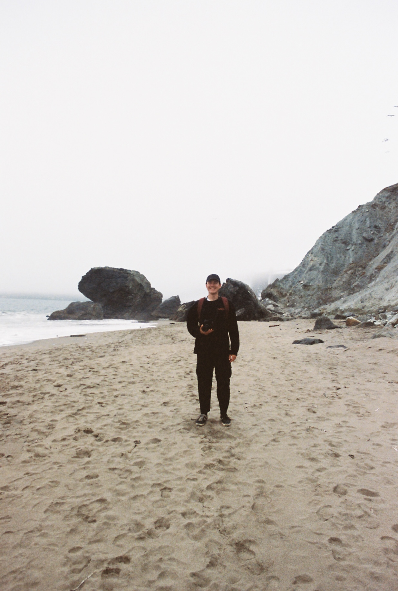

::: {.about-grid}

::: {.about-aside}
{fig-alt="Miles Moore standing on a sandy beach in fog with rocks behind him."}

<dl class="about-meta">
<dt>Position</dt><dd>PhD student, Ecology &amp; Evolutionary Biology</dd>
<dt>Institution</dt><dd>University of Colorado Boulder</dd>
<dt>Fellowship</dt><dd><a href="https://www.krellinst.org/csgf/">DOE CSGF</a></dd>
<dt>Based in</dt><dd>Boulder, Colorado</dd>
<dt>Email</dt><dd><a href="mailto:miles@milesalanmoore.com">miles@milesalanmoore.com</a></dd>
</dl>
:::

::: {.about-main}

::: {.lede}
I am a PhD student and Department of Energy Computational Science Graduate Fellow at the University of Colorado Boulder. A **biostatistician**, **quantitative ecologist**, and **eco-evolutionary biologist**, I work on phenology, the temporal dynamics of key life-cycle events like growth, reproduction, and maturation, in response to variable environmental information. I am particularly motivated by phenological change in high-mountain and agricultural ecosystems because of what it means for ecological resilience and for human food and water security.
:::

I have extensive experience with *hierarchical* and *causal* models in the life sciences. For my research I develop mechanistic models based on **state-space** and **latent-variable** frameworks, including time-to-event ("survival") and **hidden Markov models**.

::: {.chip-row}
[Bayesian inference]{.chip} [State-space models]{.chip} [Survival analysis]{.chip} [HPC]{.chip} [R]{.chip} [Stan]{.chip} [Python]{.chip}
:::

Outside of research I enjoy rock climbing, running, cycling, fly-fishing, reading, snowboarding, film photography, and most of all, spending time with my wife.

[Read about my research](research/index.qmd){.arrow-link}

## Education

::: {.timeline}
::: {.tl-item}
[2024 – 2029 (expected)]{.tl-when}
[Ph.D. Ecology and Evolutionary Biology]{.tl-what}
[University of Colorado Boulder]{.tl-where}
:::
::: {.tl-item}
[2022 – 2023]{.tl-when}
[B.A. Ecology and Evolutionary Biology]{.tl-what}
[University of Colorado Boulder]{.tl-where}
[Certificate in GIS & Computational Science · *summa cum laude*, with distinction, GPA 4.0]{.tl-note}
:::
::: {.tl-item}
[2019 – 2021]{.tl-when}
[Associate of Science]{.tl-what}
[Front Range Community College, Westminster, CO]{.tl-where}
:::
:::

## Research experience

::: {.timeline}
::: {.tl-item}
[Sep 2025 – present]{.tl-when}
[DOE Computational Science Graduate Fellow]{.tl-what}
[Krell Institute]{.tl-where}
:::
::: {.tl-item}
[May – Aug 2025]{.tl-when}
[Graduate Research Assistant]{.tl-what}
[Cooperative Institute for Research in Environmental Sciences, Boulder, CO]{.tl-where}
:::
::: {.tl-item}
[Dec 2023 – Aug 2024]{.tl-when}
[Professional Scientist I]{.tl-what}
[Institute of Arctic and Alpine Research, Boulder, CO]{.tl-where}
:::
::: {.tl-item}
[May – Dec 2023]{.tl-when}
[Remote Sensing Intern]{.tl-what}
[National Aeronautics and Space Administration, Greenbelt, MD]{.tl-where}
:::
::: {.tl-item}
[Aug 2021 – Dec 2023]{.tl-when}
[Data Management Assistant]{.tl-what}
[Institute of Arctic and Alpine Research, Boulder, CO]{.tl-where}
:::
::: {.tl-item}
[May – Aug 2021]{.tl-when}
[Field Research Assistant]{.tl-what}
[Niwot Ridge Long Term Ecological Research (LTER) site, Boulder, CO]{.tl-where}
:::
:::

## Teaching

::: {.timeline}
::: {.tl-item}
[Aug – Dec 2024]{.tl-when}
[Teaching Assistant, EBIO 4410 / 5410 Biological Statistics]{.tl-what}
[University of Colorado Boulder]{.tl-where}
:::
:::

:::
:::
