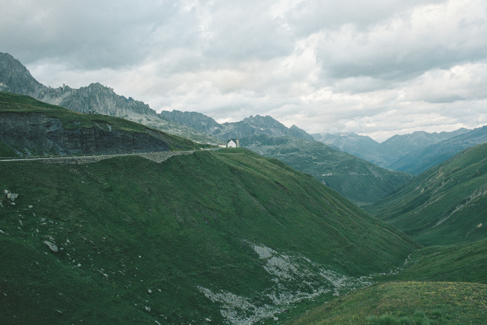

::: {.hero}
::: {.hero-text}
[PhD student · Computational ecologist · Eco-evo Biologist]{.eyebrow}

<h1 class="hero-name">Studying the <em>timing</em> of life in a changing environment.</h1>

::: {.lede}
I'm a PhD student and **DOE Computational Science Graduate Fellow** at the University of Colorado Boulder studying plant biology & phenology (the timing of growth, reproduction, and dispersal). Biological data are always messy and complex. I build advanced models that make the most of imperfect observations by connecting theory, observation processes, and data to drive **actionable conclusions**. What's driving change? How certain are we? Where should we look next?
:::

::: {.hero-actions}
[Read about my research](research/index.qmd){.btn-mm}
[About me](about.qmd){.arrow-link}
[Get in touch](mailto:miles@milesalanmoore.com){.arrow-link}
:::

::: {.stat-row}
::: {.stat}
**CU Boulder**
Ecology & Evolutionary Biology
:::
::: {.stat}
**Institute of Arctic and Alpine Research**
Niwot Ridge LTER
:::
::: {.stat}
**Department of Energy**
Computational Science Graduate Fellow
:::
:::
:::

<figure class="hero-figure">

<!-- <figcaption>Furka Pass, Switzerland. Shot on film.</figcaption> -->
</figure>
:::

<!-- -------------------------------------------------------------------------->
<!-- What I work on -->
<!-- -------------------------------------------------------------------------->

::: {.band}
::: {.band-head}
## []{.card-icon} What I work on
[Research](research/index.qmd){.arrow-link}
:::

::: {.grid}
::: {.g-col-12 .g-col-md-4}
::: {.mm-card}
[]{.card-icon}

### What sets the timing of life?
How snowmelt, heat, and drought control when plants grow, flower, and set seed, and why those responses diverge across places and species, from high alpine tundra to agriculture.
:::
:::

::: {.g-col-12 .g-col-md-4}
::: {.mm-card}
[]{.card-icon}

### Adaptation or mismatch?
When a shift in timing tracks a moving climate optimum, and when it leaves wild plants and crops out of step with their environment, with consequences for yield, resilience, and food security.
:::
:::

::: {.g-col-12 .g-col-md-4}
::: {.mm-card}
[]{.card-icon}

### What can the data support?
Separating real drivers of ecological change from noise: evaluating whether interventions like restoration actually work, and connecting field and satellite observations to the models used to forecast land-surface change.
:::
:::

:::
:::

<!-- -------------------------------------------------------------------------->
<!-- Tools I use -->
<!-- -------------------------------------------------------------------------->

::: {.band}
::: {.band-head}
## []{.card-icon} Tools I use
[GitHub](https://github.com/milesalanmoore){.arrow-link}
:::

::: {.grid}

::: {.g-col-12 .g-col-md-4}
::: {.mm-card}
[]{.card-icon}

### Theory & simulation
I build mechanistic, theory-based models of biological systems from first principles and study how low-level biology scales to produce emergent ecological processes.

:::
:::

::: {.g-col-12 .g-col-md-4}
::: {.mm-card}
[]{.card-icon}

### Hierarchical Bayesian modeling
Connecting theory to data and comparing candidate models requires latent-variable frameworks with explicit observation processes. I build bespoke and novel models that propogate uncertainity and enable decision making.

:::
:::


::: {.g-col-12 .g-col-md-4}
::: {.mm-card}
[]{.card-icon}

### Computation at scale
Simulation-based inference, multithreaded Bayesian models, and machine learning on high-performance systems, so the models can be as mechanistic as the biology demands, built as tested, reproducible research software.

:::
:::

:::
:::

<!-- -------------------------------------------------------------------------->

::: {.band}
::: {.band-head}
## Recent publications
[All publications](research/index.qmd#publications){.arrow-link}
:::

```{r}
#| output: asis
pubs <- yaml::read_yaml("research/publications.yml")
pubs <- pubs[seq_len(min(3, length(pubs)))]
for (pub in pubs) {
  cat("::: {.pub-card}\n")
  cat("::: {.pub-year}\n", pub$year, "\n:::\n", sep = "")
  cat("::: {.pub-body}\n")
  cat("::: {.pub-title}\n", pub$title, "\n:::\n", sep = "")
  cat("::: {.pub-authors}\n", pub$authors,
      if (nchar(pub$journal) > 0) paste0(". *", pub$journal, "*") else "",
      "\n:::\n", sep = "")
  cat(":::\n:::\n\n")
}
```
:::

::: {.band}
::: {.band-head}
## Latest news
[All news](news/index.qmd){.arrow-link}
:::

::: {#latest-news}
:::
:::
