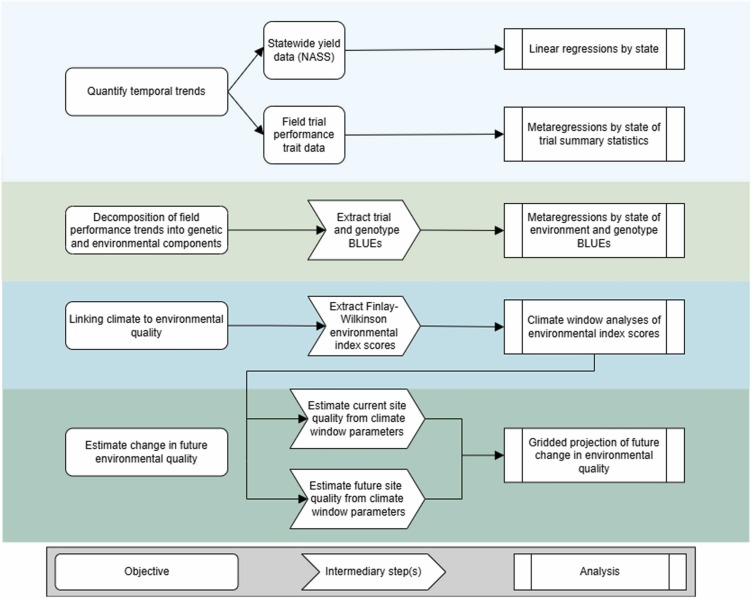

::: {style="margin-bottom: 2rem; text-align: center;"}
<a class="link-dark me-1" href="https://doi.org/10.1016/j.fcr.2026.110623" title="DOI" target="_blank" rel="noopener"></a> [Published paper](https://doi.org/10.1016/j.fcr.2026.110623) ||
<a class="link-dark me-1" href="https://authors.elsevier.com/c/1nulD1M2tVgkWq" title="Full-text" target="_blank" rel="noopener"></a> [Full-text](https://authors.elsevier.com/c/1nulD1M2tVgkWq)
:::

::: {.featured-image}

:::

## Highlights

- Genetic improvement has been focused on Northern Great Plains states.
- Sunflower yield increased by ~50% in northern states with less or no improvement in other areas.
- Genetic and environmental components both contribute to yield gain variation.
- Environmental change sometimes counteracted yield and quality improvements.

## Abstract

**Context.** While past decades have seen substantial gains in crop productivity, how much of this is due to genetic improvement versus changes in growing environment, including climate and management practices, remains unclear. Separating the roles of breeding improvements and environmental changes in crop improvement requires comprehensive data, including phenotypic data on plant varieties released over multiple years and environmental data that characterizes the variable growing conditions. Leveraging long-term variety field trial data is one way to evaluate the relative effects of crop genetic improvement and changes in environment to overall crop improvement over time.

**Methods.** Using a dataset of 46 years of commercial sunflower variety trial data from across the Great Plains of the US, we quantified the contributions of plant genotype (hybrid variety) and environment (including agronomy and climate) to overall productivity in these trials and compared them to long-term public farm-gate data. We determined the major meteorological drivers of sunflower yield improvements and projected how environmental quality for sunflower production in the Great Plains will change in the future.

**Results.** The rate of genetic improvement varied across the region, and environmental change was sometimes antagonistic to the goal of yield and quality improvements. The northern Great Plains experienced substantial increases in sunflower yield since the 1970s due to gains in both breeding and environmental quality, whereas the southern Great Plains had smaller genetic gains which were largely offset by a decrease in environmental quality. High yielding environments were associated with an optimal daily maximum temperature near 28°C at flowering time, low vapor pressure deficit, and high growing degree days. Under projected future climate scenarios, environmental quality for sunflower production, as defined by these parameters, will decrease across much of the growing region. As a result, sunflower production would be reduced in much of the Great Plains by mid-century, unless breeding and agronomy change to broaden environmental tolerances.

**Implications.** These insights inform strategies for breeders, agronomists, and farmers to optimize crop performance to local and regional climates, improve climate resilience, and maximize food security.
